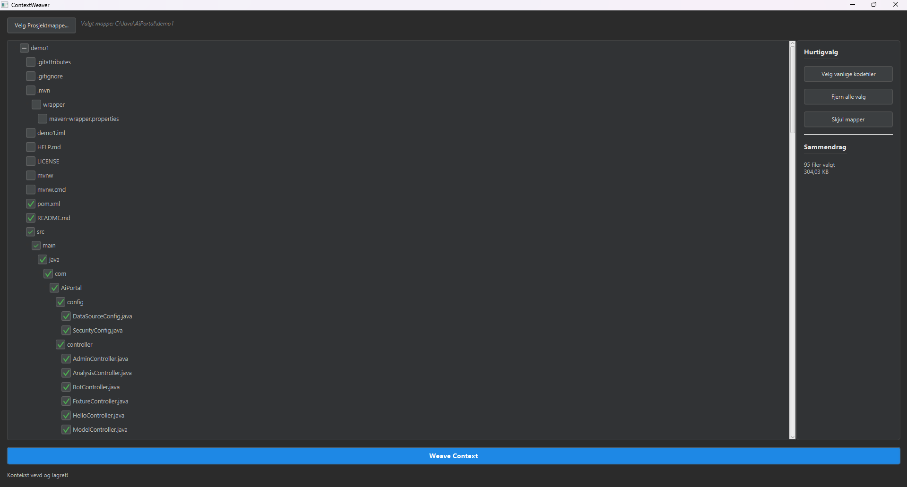
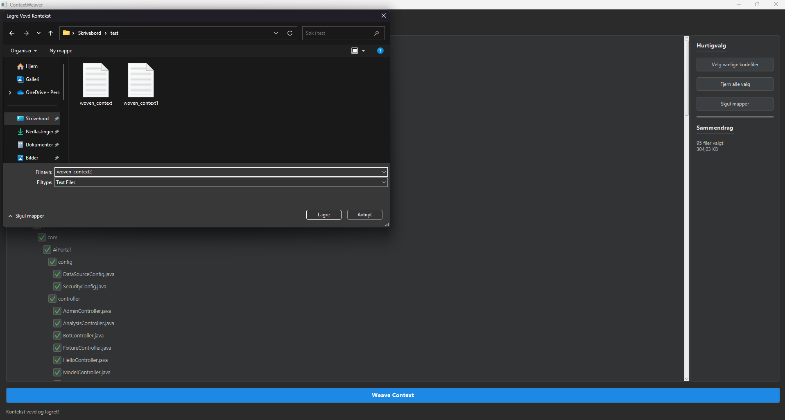
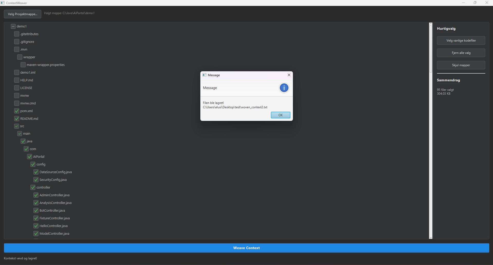
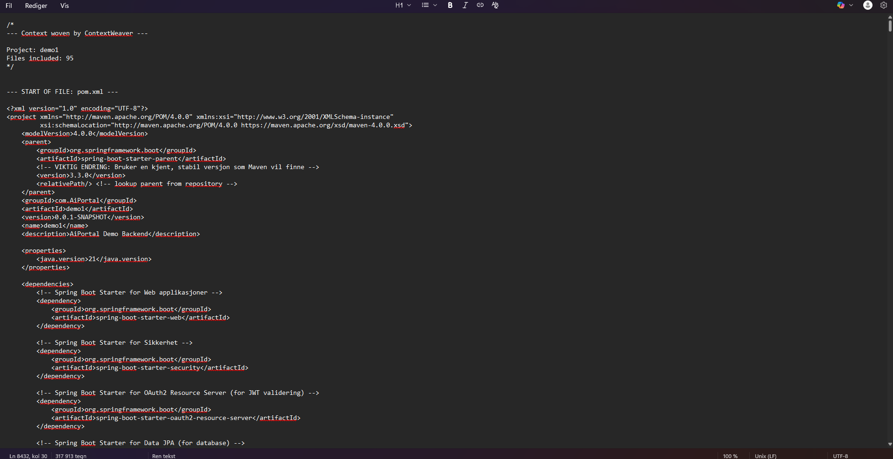

# ContextWeaver

**ContextWeaver** er et skrivebordsverktøy utviklet for å drastisk effektivisere arbeidsflyten for **studenter, hobbyister og utviklere** som bruker nettleserbaserte AI-assistenter som ChatGPT, Claude, AI Studio og lignende.

Det løser det tidkrevende problemet med å manuelt kopiere og lime inn kode fra flere filer for å gi AI-en nok kontekst.

---

## Visuell Oversikt

Her er noen glimt av hvordan ContextWeaver ser ut og fungerer.

| Velg filer i en fullstendig tre-visning | Bytt til en "flat" liste med kun filer |
| :----------------------------------------------------------: | :----------------------------------------------------------: |
|  |  |
| **Hurtigvalg av alle relevante kodefiler** | **Ferdig generert kontekstfil** |
|         |  |

---

## Problemstilling og Målgruppe

### Hvem er dette verktøyet for?
Enten du er **student** som jobber med et skoleprosjekt, en **hobbyist** som utforsker ny teknologi, eller en **profesjonell utvikler** som bruker AI-chatter for rask prototyping – er dette verktøyet designet for deg. Det er perfekt for alle som bruker nettleserbaserte AI-verktøy som en sentral del av kodehverdagen.

### Problemet det løser
Den manuelle prosessen med å åpne hver fil, kopiere innholdet og lime det inn i en prompt er en stor flaskehals. I AI-chatter går man ofte fort tom for "tokens", og kontekstvinduet må fylles på nytt.

I tillegg har mange nettleserbaserte AI-chatter en kritisk begrensning: de aksepterer ikke direkte opplasting av kodefiler. Du kan ofte ikke dra og slippe `.java`, `.ts`, eller `.py`-filer inn i chatten.

**ContextWeaver løser dette ved å pakke alt innholdet inn i én enkelt `.txt`-fil.** Siden ren tekst er et universelt format, kan du enkelt kopiere og lime inn hele konteksten i chatten uten problemer med filtype-restriksjoner eller manuell kopiering.

> **Merk:** Selv om det finnes mer avanserte metoder for AI-integrasjon (via API-er, IDE-plugins etc.), løser ContextWeaver et veldig spesifikt og vanlig problem for den store gruppen brukere – enten de er studenter, hobbyister eller profesjonelle – som bruker de populære, nettleserbaserte AI-tjenestene i sitt daglige arbeid.

## Funksjoner

-   **Grafisk Grensesnitt:** Et intuitivt og rent brukergrensesnitt bygget med JavaFX.
-   **Visuell Filutforsker:** Velg en prosjektmappe og få en interaktiv tre-visning av hele filstrukturen.
-   **Selektiv Filvelging:** Huk av nøyaktig de filene og mappene du vil inkludere. Hakene blir grønne for tydelig visuell tilbakemelding.
-   **Hurtigvalg:** Velg automatisk alle vanlige kodefiler (.java, .js, .py, .css etc.) med ett klikk.
-   **Vis/Skjul Mapper:** Bytt mellom en hierarkisk visning og en "flat" liste som kun viser filer for enklere navigering.
-   **Dra-og-slipp:** Bare dra en mappe fra filutforskeren din og slipp den i appen for å laste den inn.
-   **Én Samlet Fil:** Genererer én enkelt `.txt`-fil med alt det valgte innholdet, pent formatert og klar til å bli kopiert.

## Teknologistack

-   **Språk:** Java
-   **GUI Rammeverk:** JavaFX
-   **Byggesystem:** Apache Maven

## Hvordan kjøre prosjektet

**Forutsetninger:**
-   Java JDK 17 eller nyere.
-   Apache Maven.

1.  **Klone repositoriet:**
    ```bash
    git clone https://github.com/ditt-brukernavn/ContextWeaver.git
    cd ContextWeaver
    ```
2.  **Kjør med Maven:**
    Den anbefalte måten å kjøre appen på er å bruke JavaFX Maven-pluginen. Dette sikrer at alle moduler lastes korrekt.
    ```bash
    mvn clean javafx:run
    ```
3.  **Bruk verktøyet!**

## Lisens

Dette prosjektet er lisensiert under [MIT-lisensen](LICENSE).